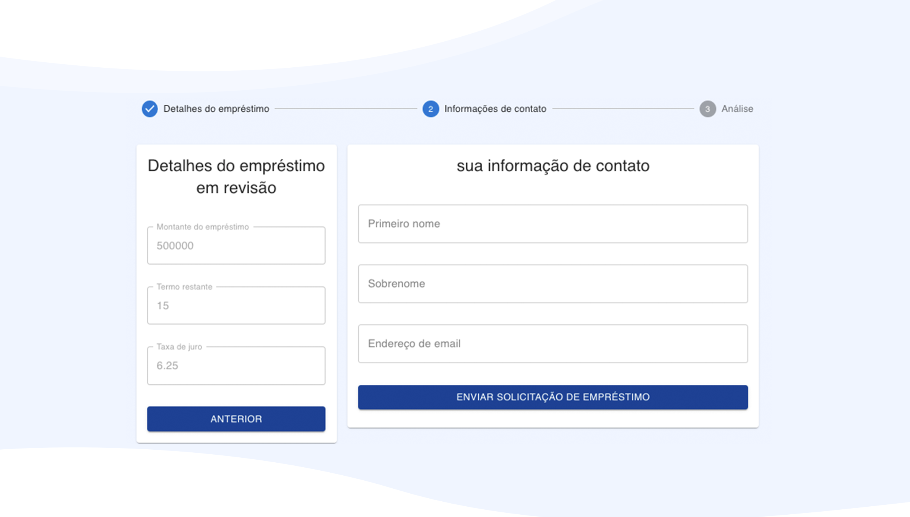
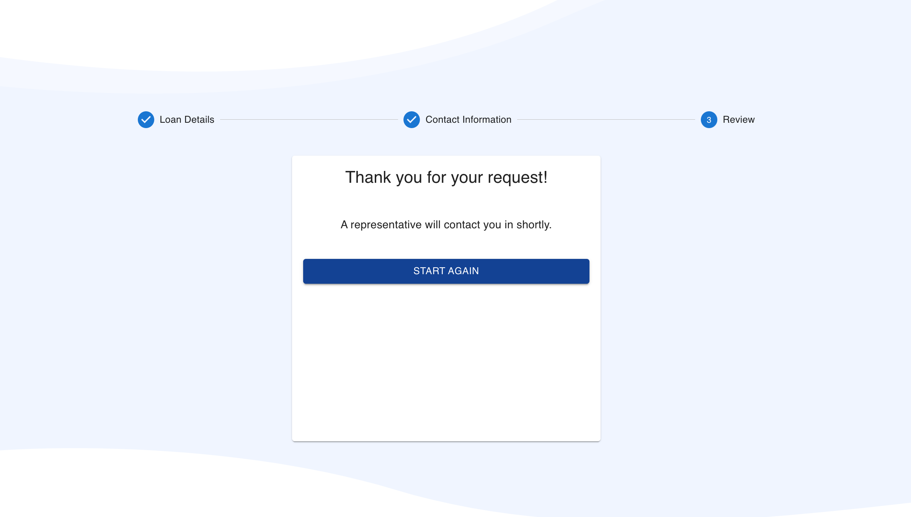

# React ローン計算機とフォームの提出
React コンポーネントを使用し、Liferay オブジェクトデータの取得と追加を活用するマルチステップコンポーネントの例です。
このコンポーネントには、ユーザーの Liferay 言語設定に基づいて、フランス語、ポルトガル語、スペイン語、英語、日本語の翻訳コンテンツも含まれています。





### 使用方法
このリソースは、7.4 リモートアプリケーション（カスタム要素）または LXC のクライアント拡張サービスとして使用できます。

## 前提条件：必要な Lifeary オブジェクトの作成

1. 次のようにオブジェクトを作成します：
    * ラベル: "Rate"
    * 複数のラベル: "Rates"
    * オブジェクト名: "Rate"
    * スコープ: Company
    * *このオブジェクトは、ユーザーが選択できる金利のリストを表します。

2. オブジェクトには次のフィールドを追加：

    | フィールド | タイプ       | 必須      |
    | :---     |   :----:    |  :----:   |
    | Rate   | Decimal   | Yes       |
    | Term   | Integer   | Yes       |

3. 新しい Rate オブジェクトを公開します。

4. コンポーネントで使用するいくつかの金利レコードを追加します：

    | Rate   | Term      |
    | :---   |   :----:  |
    | 6.75   | 30        |
    | 6.25   | 15        |
    | 5.75   | 10        |
    
5. 各 Rate のアクセス許可を設定し、ゲストユーザーが各レコードを表示できるようにします。これは、レートリスト内の各レートのメニューの[設定]オプションから行うことができます。

6. 以下のように 2 番目のオブジェクトを作成します：

    * ラベル: "Loan Request"
    * 複数のラベル: "Loan Requests"
    * オブジェクト名: "LoanRequest"
    * スコープ: Company
    * *このオブジェクトは、このコンポーネントから送信されるローンリクエストを表します。

7. オブジェクトには次のフィールドが必要です：

    | フィールド          |  タイプ         | 必須     |
    | :---              |   :----:      |  :----:  |
    | Amount         | LongInteger | No        |
    | Rate           | Decimal     | No        |
    | Term           | Integer     | No        |
    | First Name     | Text        | No        |
    | Last Name      | Text        | No        |
    | Email Address  | Text        | No        |

8. 新しい Loan Request オブジェクトを公開します。

## LXC-SM のJenkinsでのビルド/デプロイ

1. LXC-SM プロジェクトをアップロードします（フォルダ構造を保持します）、Jenkins が自動的にビルドします。
2. プロジェクトがビルドされた後、それを UAT/DEV/PRD スロットにデプロイします。
3. デプロイが成功した後、このリモートアプリケーションを[アプリケーション] -> [CUSTOM APPS] -> [Client Extensions]で見つけることができます。


*これにより、Liferay サーバーで JavaScript リソースがホストされます。

# その他のデプロイメソッドオプション
## ローカルマシンで React アプリをビルドする
リポジトリをクローンし、次の手順を実行します：

```
cd liferay/client-extensions/react-loan-calculator
yarn install
npm run build
```

* ビルドが完了した後、次のファイルを見つけることができます：
```
build/static/js/main.4dc1c35e.js
build/static/css/main.dc4d6ff2.css
```

## デプロイして使用する
### [オプション 1] リモートサーバーまたは LXC クライアント拡張サービスにこの JavaScript リソースをホストする

1. `lcp deploy` を使用してビルドします。
2. `/dist/react-loan-calculator.zip` が作成された後、`lcp deploy` を使用して LXC-Client 拡張スロットにデプロイします。

例：
```
lcp deploy --project extxxxxxxx-extuat --ext ./dist/yyyyy.zip
```


### [オプション 2] ドキュメントライブラリに JavaScript リソースを追加する
## 設定手順
これらをリモートアプリケーションまたは LXC クライアント拡張サービスの定義

